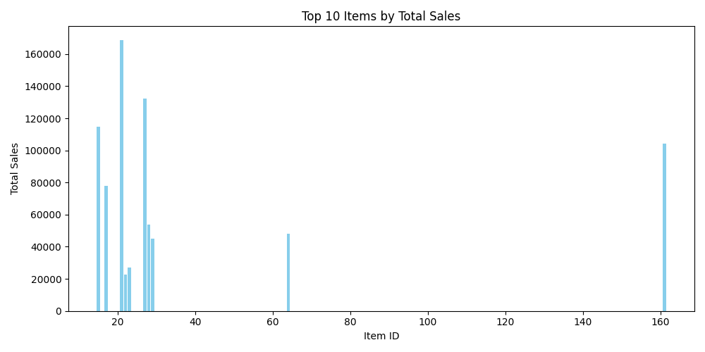

# 🤖 AI Agent to Answer E-commerce Data Questions

This project is an AI-powered assistant that understands natural language questions about e-commerce data and answers with relevant SQL queries, visualizations, and human-readable insights.

---

## 💡 Project Summary

The goal is to assist users (non-technical or technical) in querying complex e-commerce datasets using plain English. The system interprets user intent, generates appropriate SQL queries, fetches results, and optionally visualizes them with charts.

It is especially useful for businesses that need:
- Quick insights into sales, ads, product eligibility
- Visual answers to data questions
- Automated dashboards or decision-making tools

---

## 🧠 Key Features

- 🔄 Converts natural language to SQL using LLMs (OpenAI, Gemini, or Local LLMs)
- 📊 Auto-generates charts for visual output
- 🧾 Human-readable summaries of data insights
- 📁 Works with multiple datasets: product eligibility, ad sales, total sales

---

## 📊 Example Output

*Chart generated from a user query: “Show me the top 10 items by total sales.”*

---

## 📁 Datasets Used

- `eligibility.csv` – Product-level eligibility details
- `ad_sales.csv` – Ad campaign performance and metrics
- `total_sales.csv` – Raw and aggregated sales metrics

These datasets are structured in CSV format and loaded using pandas and/or SQLAlchemy.

---

## 🛠️ Tech Stack

- **Python 3.9+**
- **Pandas** – for data manipulation
- **Matplotlib** – for visualizing data
- **LangChain / Prompt Engineering** – for question interpretation
- **OpenAI / Gemini 2.5 / Mistral** – for intent parsing (LLMs)
- **Flask ** – for UI 

